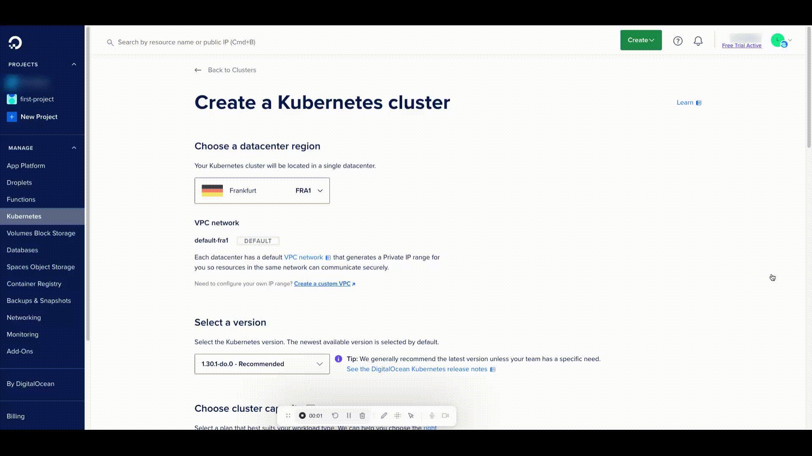
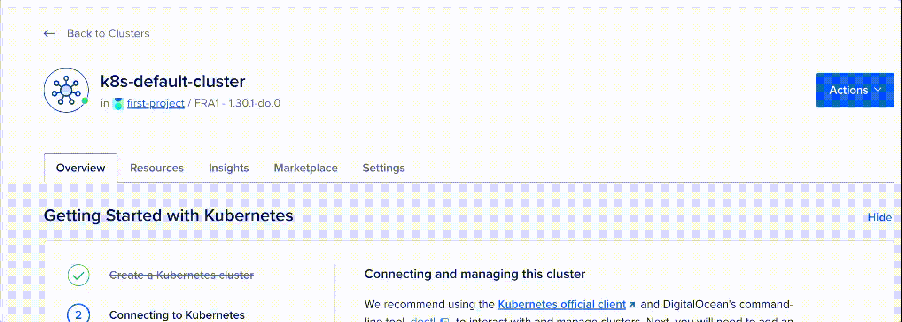
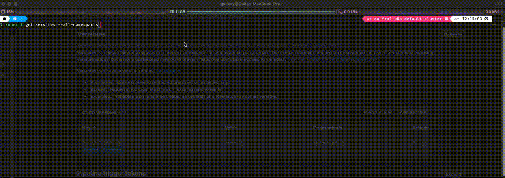
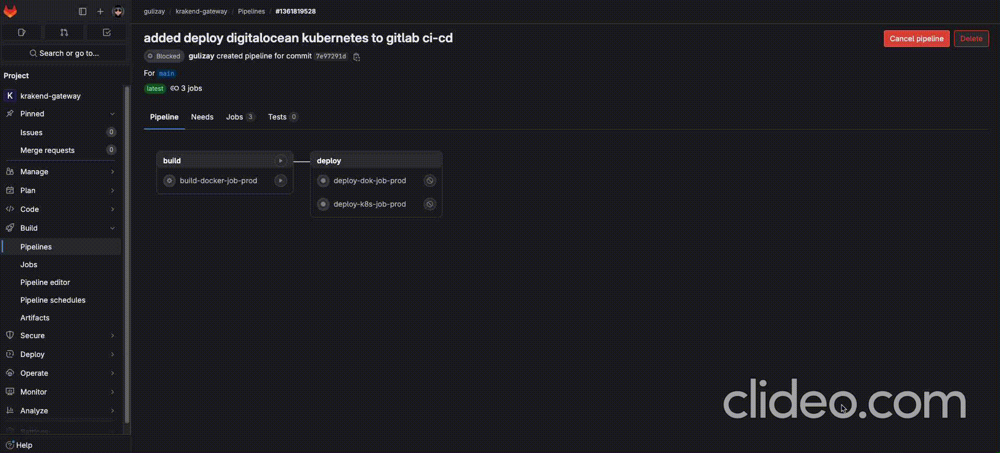
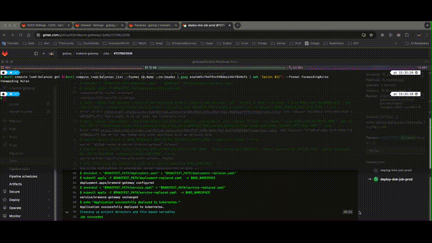

# krakend-gateway

## Docker
### build docker image
```sh
# /krakend-gateway>
docker rm -f krakend-gateway || true && \
		docker rmi -f \$(docker images -q krakend-gateway) || true && \
			docker build --build-arg ENV=dev -t krakend-gateway . && \
				docker run -d -p 8080:8080 --name krakend-gateway krakend-gateway
```
or you can use phony target
```sh
# /krakend-gateway>
make run_docker_gateway
```

## K8S - Deployment
### run namespace once
```sh
# /krakend-gateway>
kubectl apply -f /k8s-manifests/namespace.yaml # create namespaces
kubectl apply -f /k8s-manifests/deployment.yaml # deployment
kubectl apply -f /k8s-manifests/service.yaml # service
```

### DigitalOcean Kubernetes Cluster


Follow the instructions for connection digital ocean kubernetes cluster



```sh
doctl kubernetes cluster kubeconfig save <your-token>
kubectl cluster-info
```


Make sure Add DO_API_TOKEN variable to GitLab CI/CD Settings Variables, and CI_DEPLOY_USER and CI_DEPLOY_PASSWORD for the docker registry in access token


Run GitLab Pipeline, Deploy to DigitalOcean Kubernetes cluster


Check Kubernetes Deployment


### Kubernetes Network Topology
